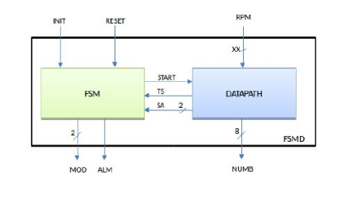

# Elaborato1 SIS - Architettura degli Elaboratori

Primo elaborato di Architettura degli Elaboratori, Università di Verona.
Linguaggio SIS.

### Schema generale del circuito
Il nostro dispositivo permette il monitoraggio di un motore a combustione interna basato su un circuito sequenziale che riceve come input il numero di giri/minuto del motore (RPM) e fornisce in uscita una modalità di funzionamento del motore: sottogiri (SG), in regime ottimale (OPT) o fuorigiri (FG). In uscita restituisce inoltre da quanto tempo il sistema si trova nello stato attuale ed un ulteriore output di allarme che vale 1 se e soltanto se il sistema è in stato FG da più di 15 secondi (cicli di clock).
Il circuito è composto da un controllore e da un datapath con i seguenti ingressi e uscite.
- INIT[1]: quando vale 1 indica che il circuito ha iniziato la rilevazione del numero di giri. Il controllore passa nello stato di conteggio dei secondi trascorsi nell’attuale modalità. Finché vale 0 non svolge alcun conteggio né indica alcun valore in uscita.
- RESET[1]: se posto a 1 il controllore si resetta, ovvero il contatore dei secondi viene posto a zero.
- RPM[13]: valore del numero di giri ricevuto dal rilevatore (valore massimo 6500).
- MOD[2]: indica in quale modalità di funzionamento si trova l'apparecchio al momento corrente (00 – spento, 01 – SG, 10 – OPT, 11 – FG).
- NUMB[8]: indica i secondi trascorsi nell’attuale modalità.
- ALM[1]: segnala il superamento del tempo limite in FG.

Il controllore è collegato al datapath con tre segnali che hanno il seguente significato:
- START[1]: messo a 1 fa iniziare al datapath la lettura dei RPM, il set dello stato di soglia, e l’inizio del conteggio secondi in soglia.
- SA[2]: imposta il controllore allo stato di soglia attuale.
- TS[1]: segnala al controllore il superamento della soglia di tempo.

Il rilevatore manda un valore RPM al secondo. Tale valore fa parte degli ingressi impostati durante la simulazione. Ad ogni valore RPM in ingresso, il circuito controlla l’attuale soglia, imposta lo stato corrispondente e inizia a contare (o incrementa il contatore). Nel momento in cui il valore RPM non fa parte dell’attuale soglia, il circuito cambia stato e inizia da zero il conteggio. Ad ogni inserimento di RPM, se INIT è attivo e non vi è reset, il circuito riporta i valori aggiornati delle uscite. I valori delle soglie sono i seguenti:
- RPM < 2000 → SG
- 2000 ≤ RPM ≤ 4000 → OPT
- RPM > 4000 → FG

### Autori

* **Samuele Mori** - [Samu27](https://github.com/Samu27)
* **Emmanuel Rocchetti**

### Licenza

Questo progetto è sotto la licenza GPL_v3 - guarda il file [LICENSE.md](LICENSE.md) per ulteriori informazioni
